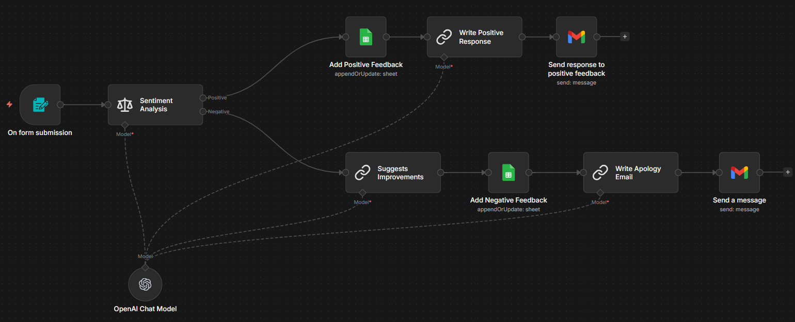

# W6-n8n-Use-Case-01 — Customer Feedback Automation

## Overview

This n8n workflow automates the end-to-end handling of customer feedback for **RockwithAI**, an AI Automation Agency specializing in helping SMEs implement AI Agents and AI Automation solutions. When a customer submits feedback through a web form, the workflow automatically classifies the sentiment, logs it to a Google Sheet, generates an appropriate AI-powered email response, and sends it — all without manual intervention.

---

## Business Logic

The workflow follows a branching strategy based on sentiment:

1. A customer fills out a feedback form (Name, Email, Feedback).
2. The feedback text is run through AI-powered sentiment analysis, which classifies it as either **Positive** or **Negative**.
3. Depending on the classification, the workflow takes one of two paths:

**Positive Path** → Log to "Positive" sheet → Generate a thank-you email → Send via Gmail.

**Negative Path** → Generate improvement suggestions → Log to "Negative" sheet (with suggestions) → Generate an apology email with a compensation offer → Send via Gmail.

---

## Architecture Diagram

---

## Node-by-Node Reference

### 1. On form submission

| Property       | Value                                    |
|----------------|------------------------------------------|
| **Type**       | `n8n-nodes-base.formTrigger` (v2.2)      |
| **Role**       | Trigger — starts the workflow            |


**Description:**
Presents a web-hosted form titled "Customer Feedback" with the description *"We value your feedback! Let us know about your experience and what we can improve."* When a user submits the form, the workflow is triggered.

**Form Fields:**

| Field    | Type     | Placeholder                            | Required |
|----------|----------|----------------------------------------|----------|
| Name     | text     | Please enter your name...              | Yes      |
| Email    | email    | Please enter your email...             | Yes      |
| Feedback | textarea | Please describe your experience...     | Yes      |

**Output Data:** `{{ $json.Name }}`, `{{ $json.Email }}`, `{{ $json.Feedback }}`

---

### 2. Sentiment Analysis

| Property       | Value                                              |
|----------------|----------------------------------------------------|
| **Type**       | `@n8n/n8n-nodes-langchain.sentimentAnalysis` (v1.1) |
| **Role**       | AI classification of feedback sentiment             |

**Description:**
Takes the `Feedback` field from the form submission and classifies it into one of two categories: **Positive** or **Negative**. This node has two output branches — output 0 (Positive) and output 1 (Negative) — which route the workflow accordingly.

**Configuration:**
- **Input Text:** `{{ $json.Feedback }}`
- **Categories:** `Positive, Negative`
- **AI Model:** OpenAI Chat Model (gpt-4o-mini) — connected via the `ai_languageModel` input

---

### 3. OpenAI Chat Model (Shared)

| Property       | Value                                              |
|----------------|----------------------------------------------------|
| **Type**       | `@n8n/n8n-nodes-langchain.lmChatOpenAi` (v1.2)     |
| **Role**       | Shared LLM provider for all AI nodes               |


**Description:**
A single OpenAI Chat Model node that serves as the language model for four downstream AI nodes: Sentiment Analysis, Write Positive Response, Suggests Improvements, and Write Apology Email. Using a shared model node keeps the configuration DRY and centralizes the API credential.

---

## Positive Sentiment Path

### 4. Add Positive Feedback (Google Sheets)

| Property       | Value                                              |
|----------------|----------------------------------------------------|
| **Type**       | `n8n-nodes-base.googleSheets` (v4.6)               |
| **Operation**  | Append or Update                                    |


**Description:**
Logs the positive feedback to the **"Positive"** sheet (gid=0) in the Google Sheets document titled "Customer Feedback Form."

**Column Mapping:**

| Column   | Value Source                                   |
|----------|------------------------------------------------|
| Name     | `{{ $('On form submission').item.json.Name }}`     |
| Email    | `{{ $('On form submission').item.json.Email }}`    |
| Feedback | `{{ $('On form submission').item.json.Feedback }}` |

**Matching Column:** `Email` (used for upsert — if same email submits again, the row is updated rather than duplicated).

---

### 5. Write Positive Response (LLM Chain)

| Property       | Value                                              |
|----------------|----------------------------------------------------|
| **Type**       | `@n8n/n8n-nodes-langchain.chainLlm` (v1.7)         |
| **Role**       | Generates a thank-you email via AI                 |


**Prompt Summary:**
The LLM is instructed to act as a customer support representative for RockwithAI and write a friendly response to the customer's positive feedback. The output must be formatted as raw HTML (no markdown fencing) and signed from **Kombaraj at RockwithAI**.

**Inputs referenced:** Customer Name, Feedback (from form submission node).

---

### 6. Send response to positive feedback (Gmail)

| Property       | Value                                              |
|----------------|----------------------------------------------------|
| **Type**       | `n8n-nodes-base.gmail` (v2.1)                       |
| **Role**       | Sends the AI-generated thank-you email              |

**Configuration:**
- **To:** `{{ $('On form submission').item.json.Email }}`
- **Subject:** `Thank you for your valuable feedback`
- **Body:** `{{ $json.text }}` (HTML output from the LLM)
- **Attribution:** Disabled

---

## Negative Sentiment Path

### 7. Suggests Improvements (LLM Chain)

| Property       | Value                                              |
|----------------|----------------------------------------------------|
| **Type**       | `@n8n/n8n-nodes-langchain.chainLlm` (v1.7)         |
| **Role**       | Generates improvement suggestions from feedback    |


**Prompt Summary:**
The LLM reviews the negative feedback and provides concise suggestions on what RockwithAI can do to address the customer's concerns and improve satisfaction in the future. This output is stored in the Google Sheet alongside the feedback for internal review.

---

### 8. Add Negative Feedback (Google Sheets)

| Property       | Value                                              |
|----------------|----------------------------------------------------|
| **Type**       | `n8n-nodes-base.googleSheets` (v4.6)               |
| **Operation**  | Append or Update                                   |


**Description:**
Logs the negative feedback to the **"Negative"** sheet (gid=1390084983) in the same Google Sheets document, including the AI-generated improvement suggestion.

**Column Mapping:**

| Column     | Value Source                                       |
|------------|---------------------------------------------------|
| Name       | `{{ $('On form submission').item.json.Name }}`         |
| Email      | `{{ $('On form submission').item.json.Email }}`        |
| Feedback   | `{{ $('On form submission').item.json.Feedback }}`     |
| Suggestion | `{{ $json.text }}` (output from Suggests Improvements) |

**Matching Column:** `Email`

---

### 9. Write Apology Email (LLM Chain)

| Property       | Value                                              |
|----------------|----------------------------------------------------|
| **Type**       | `@n8n/n8n-nodes-langchain.chainLlm` (v1.7)         |
| **Role**       | Generates a conciliatory response email            |


**Prompt Summary:**
The LLM drafts a friendly and concise apology email that:
- Thanks the client for their feedback.
- Acknowledges their specific concerns.
- Informs them the matter has been escalated to management.
- Offers to extend their current automation package with **one additional AI Agent integration at no extra charge** as compensation.

Output is formatted as raw HTML, signed from **Kombaraj at RockwithAI**.

---

### 10. Send a message (Gmail)

| Property       | Value                                              |
|----------------|----------------------------------------------------|
| **Type**       | `n8n-nodes-base.gmail` (v2.1)                      |
| **Role**       | Sends the apology/compensation email               |


**Configuration:**
- **To:** `{{ $('On form submission').item.json.Email }}`
- **Subject:** `We're sorry here's how we'll fix this`
- **Body:** `{{ $json.text }}` (HTML output from the LLM)
- **Attribution:** Disabled

---

## External Dependencies

| Service        | Purpose                                                     |
|----------------|-------------------------------------------------------------|
| **OpenAI API** | Powers sentiment analysis, email generation, and suggestion generation via gpt-4o-mini |
| **Google Sheets** | Stores categorized feedback in a spreadsheet with "Positive" and "Negative" tabs |
| **Gmail**      | Sends automated response emails to customers                |

**Google Sheets Document:** "Customer Feedback Form"
- Sheet "Positive" : Columns — Name, Email, Feedback
- Sheet "Negative" : Columns — Name, Email, Feedback, Suggestion

---

## Data Flow Summary

```
FORM INPUT                 POSITIVE PATH                           NEGATIVE PATH
─────────                  ─────────────                           ─────────────
Name        ──────────▶    Google Sheet (Positive tab)             Google Sheet (Negative tab)
Email       ──────────▶    Gmail recipient                        Gmail recipient
Feedback    ──────────▶    LLM prompt context                     LLM prompt context
                           AI-generated thank-you HTML ──▶ Gmail   AI-generated apology HTML ──▶ Gmail
                                                                   AI-generated suggestion ──▶ Sheet
```

---

## Setup & Activation Checklist

1. **Import** the workflow JSON into your n8n instance.
2. **Configure credentials** for OpenAI, Google Sheets OAuth2, and Gmail OAuth2.
3. **Verify** the Google Sheets document exists with two sheets named "Positive" (gid=0) and "Negative" (gid=1390084983), each having the correct column headers.
4. **Update** the LLM prompts if you need to change the company name, signatory, or compensation offer.
5. **Activate** the workflow — the form trigger will then be accessible via its webhook URL.
6. **Test** by submitting the form with both positive and negative feedback samples to verify both branches work correctly.

---

