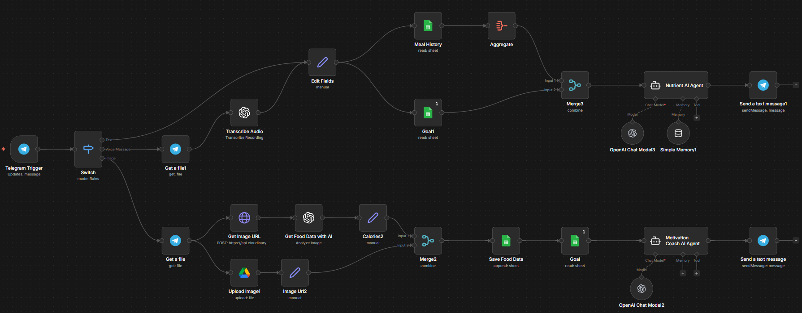

# W6-n8n-Use-Case-02 - Nutritionist AI Agent 

## Overview

This n8n workflow implements an AI-powered **personal nutrition assistant** that operates entirely through a Telegram bot. Users can send text messages, voice notes, or food photos to the bot. The workflow identifies what they ate (or what they're asking about), logs nutritional data to a Google Sheet, compares it against their personal calorie goals, and replies with coaching feedback — all in real time.

**Workflow Name:** Nutritionist AI Agent
---

## Business Logic

The workflow supports three distinct input modes from Telegram, each handled by a separate processing path:

**Text Path** — The user types a question like "Can I have a beer tonight?" The message is combined with their meal history and calorie goal, then an AI agent decides whether they can afford the calories and replies.

**Voice Message Path** — The user sends a voice note (e.g., "I just had a chicken salad"). The audio is transcribed via OpenAI Whisper, then handled identically to the text path.

**Image Path** — The user sends a photo of their food. The image is uploaded to Cloudinary (for a public URL) and Google Drive (for archival), then analyzed by GPT-4o-mini for detailed calorie and macro estimates. The nutritional data is logged to Google Sheets, the user's goal is fetched, and a Motivation Coach AI Agent replies with formatted nutrition info and coaching feedback.

---

## Architecture Diagram


---

## Google Sheets Data Model

All data is stored in a single Google Sheets document: **"Food Data"**

**Sheet 1 — "Food Data" :** Meal log

| Column   | Description                              | Example              |
|----------|------------------------------------------|----------------------|
| Name     | User's Telegram first name               | Kombaraj             |
| Date     | Date of the meal (yyyy-MM-dd)            | 2026-04-04           |
| Time     | Time of the meal (HH:mm)                 | 13:45                |
| Food     | Short name of the food from AI analysis  | burger with fries    |
| Calories | Average of low/high estimate + " kcal"   | 850 kcal             |
| Proteins | Average of low/high protein estimate (g) | 35                   |
| Carbs    | Average of low/high carbs estimate (g)   | 72                   |
| Fat      | Average of low/high fat estimate (g)     | 41                   |
| Picture  | Google Drive webViewLink to the image    | https://drive.google.com/... |

**Sheet 2 — "Goals" :** Per-user calorie targets

| Column         | Description                          |
|----------------|--------------------------------------|
| Name           | User's Telegram first name (lookup key) |
| Goal           | Descriptive goal (e.g., "weight loss")  |
| Daily Goal     | Daily calorie target in kcal            |
| Target Deficit | Target deficit in kcal                  |
| Mantain        | Maintenance calories in kcal            |

---

## Node-by-Node Reference

### 1. Telegram Trigger

| Property       | Value                                    |
|----------------|------------------------------------------|
| **Type**       | `n8n-nodes-base.telegramTrigger` (v1.2)  |
| **Role**       | Trigger — listens for incoming messages  |

Listens for any incoming Telegram message (text, voice, or photo) and passes it to the Switch node.

---

### 2. Switch

| Property       | Value                                    |
|----------------|------------------------------------------|
| **Type**       | `n8n-nodes-base.switch` (v3.2)           |
| **Mode**       | Rules                                    |


Routes the incoming message into one of three branches based on what the message contains:

| Output   | Label         | Condition                                    |
|----------|---------------|----------------------------------------------|
| Output 0 | **Text**      | `message.text` exists (string)               |
| Output 1 | **Voice Message** | `message.voice.file_id` exists (string)  |
| Output 2 | **Image**     | `message.photo` exists (array)               |

---

## Text & Voice Path (Nutrient AI Agent)

### 3. Get a file1 (Voice only)

| Property       | Value                                    |
|----------------|------------------------------------------|
| **Type**       | `n8n-nodes-base.telegram` (v1.2)         |
| **Operation**  | Get file                                 |

Downloads the voice message binary from Telegram using `message.voice.file_id`.

---

### 4. Transcribe Audio (Voice only)

| Property       | Value                                              |
|----------------|----------------------------------------------------|
| **Type**       | `@n8n/n8n-nodes-langchain.openAi` (v1.8)           |
| **Operation**  | Audio → Transcribe (Whisper)                        |


Transcribes the downloaded voice file to text using OpenAI Whisper. The transcribed text is then passed to the Edit Fields node, where it joins the same path as direct text messages.

---

### 5. Edit Fields

| Property       | Value                                    |
|----------------|------------------------------------------|
| **Type**       | `n8n-nodes-base.set` (v3.4)             |

Normalizes the text input from either source into a single `text` field:
```
{{ $json.message?.text ?? $json.text ?? '' }}
```
This ensures downstream nodes receive a consistent field regardless of whether the input was a direct text message or a transcribed voice note.

---

### 6. Meal History (Google Sheets — Read)

| Property       | Value                                    |
|----------------|------------------------------------------|
| **Type**       | `n8n-nodes-base.googleSheets` (v3)       |
| **Sheet**      | "Food Data"                              |
| **Filter**     | Name = user's Telegram first name        |
| **Returns**    | All matching rows                        |

Reads all historical meal entries for the current user from the Food Data sheet. This history is used by the Nutrient AI Agent to calculate remaining calorie budget.

---

### 7. Aggregate

| Property       | Value                                    |
|----------------|------------------------------------------|
| **Type**       | `n8n-nodes-base.aggregate` (v1)          |
| **Mode**       | Aggregate all item data                  |


Consolidates all meal history rows into a single JSON array (`data`), making it easy to pass the complete history in one prompt to the AI agent.

---

### 8. Goal1 (Google Sheets — Read)

| Property       | Value                                    |
|----------------|------------------------------------------|
| **Type**       | `n8n-nodes-base.googleSheets` (v4.5)     |
| **Sheet**      | "Goals"                                  |
| **Filter**     | Name = user's Telegram first name        |
| **Execute Once** | Yes                                    |

Fetches the user's personal calorie goal, daily target, target deficit, and maintenance calories from the Goals sheet.

---

### 9. Merge3

| Property       | Value                                    |
|----------------|------------------------------------------|
| **Type**       | `n8n-nodes-base.merge` (v3.1)            |
| **Mode**       | Combine — Cross join (all combinations)  |

Combines the aggregated meal history (Input 1) with the user's goal data (Input 2) into a single item for the Nutrient AI Agent.

---

### 10. Nutrient AI Agent

| Property       | Value                                              |
|----------------|----------------------------------------------------|
| **Type**       | `@n8n/n8n-nodes-langchain.agent` (v1.9)             |
| **LLM**        | OpenAI Chat Model3 (gpt-4o-mini)                   |
| **Memory**     | Simple Memory1 (buffer window, 10 messages)         |

**Purpose:** Answers text/voice questions like "Can I have a pizza tonight?" by analyzing the user's 7-day meal history against their calorie goal.

**Prompt Logic:**
1. Sums total calories consumed over the last 7 days (or fewer if less data).
2. Multiplies the daily goal by the number of days to get total allowed calories.
3. Subtracts consumed from allowed to get remaining budget.
4. Looks up standard calorie count for the requested item.
5. Responds with a single sentence: either "You have [X] calories left, so you can eat/drink..." or "...so you can't eat/drink..."

**Formatting rules:** Round to nearest hundred, write numbers in words, 6th–8th grade reading level, no emojis, no extra tips.

---

### 11. OpenAI Chat Model3

| Property       | Value                                    |
|----------------|------------------------------------------|
| **Type**       | `@n8n/n8n-nodes-langchain.lmChatOpenAi` (v1.2) |
| **Model**      | gpt-4o-mini                              |


LLM provider for the Nutrient AI Agent.

---

### 12. Simple Memory1

| Property       | Value                                    |
|----------------|------------------------------------------|
| **Type**       | `@n8n/n8n-nodes-langchain.memoryBufferWindow` (v1.3) |
| **Session Key** | User's Telegram chat ID                 |
| **Window Size** | 10 messages                             |

Maintains conversational context per user (keyed by `message.chat.id`) so the Nutrient AI Agent can handle follow-up questions.

---

### 13. Send a text message1

| Property       | Value                                    |
|----------------|------------------------------------------|
| **Type**       | `n8n-nodes-base.telegram` (v1.2)         |
| **Operation**  | Send text message                        |

Sends the Nutrient AI Agent's response back to the user's Telegram chat.

---

## Image Path (Food Photo Analysis)

### 14. Get a file (Telegram)

| Property       | Value                                    |
|----------------|------------------------------------------|
| **Type**       | `n8n-nodes-base.telegram` (v1.2)         |
| **Operation**  | Get file                                 |

Downloads the photo binary from Telegram using `message.photo[2].file_id` (the third resolution variant, typically the largest available).

This node feeds two parallel sub-paths: Cloudinary upload (for AI analysis) and Google Drive upload (for archival).

---

### 15. Get Image URL (Cloudinary)

| Property       | Value                                    |
|----------------|------------------------------------------|
| **Type**       | `n8n-nodes-base.httpRequest` (v4.2)      |
| **Method**     | POST                                     |
| **URL**        | `https://api.cloudinary.com/v1_1/dakni3baj/image/upload` |

Uploads the food photo to Cloudinary using an unsigned upload preset (`n8n_uploads`). Returns a public URL that can be passed to the OpenAI vision model for analysis.

**Body Parameters:**
- `file` — binary data from the Telegram photo (field: `data`)
- `upload_preset` — `n8n_uploads`

---

### 16. Upload Image1 (Google Drive)

| Property       | Value                                    |
|----------------|------------------------------------------|
| **Type**       | `n8n-nodes-base.googleDrive` (v3)        |
| **Operation**  | Upload file                              |

Uploads the same photo to a Google Drive folder named **"Food Images"**  with the filename set to the current timestamp: `{{ $now.format('yyyy-MM-dd HH:mm') }}.png`. The resulting `webViewLink` is used to store a reference in the Google Sheet.

---

### 17. Get Food Data with AI (OpenAI Vision)

| Property       | Value                                              |
|----------------|----------------------------------------------------|
| **Type**       | `@n8n/n8n-nodes-langchain.openAi` (v1.8)           |
| **Resource**   | Image → Analyze                                    |
| **Model**      | gpt-4o-mini                                        |
| **Max Tokens** | 2000                                               |

The core food analysis node. Sends the Cloudinary image URL to GPT-4o-mini with a detailed prompt that instructs the model to act as a professional nutrition analyst.

**AI Output Schema (JSON):**
```json
{
  "overview": "Brief sentence about the full plate",
  "short_name": "burger with fries",
  "items": [
    {
      "name": "Item name",
      "type": "protein | carb | fat | beverage",
      "portion_size": "e.g. 1 cup",
      "cooking_method": "if obvious",
      "macros_g": { "protein": 0, "carbs": 0, "fat": 0 },
      "calories_kcal": { "low": 0, "high": 0 },
      "assumptions": "Any guesses made"
    }
  ],
  "total_calories_kcal": { "low": 0, "high": 0 },
  "total_macros": {
    "proteins": { "low": 0, "high": 0 },
    "carbs": { "low": 0, "high": 0 },
    "fat": { "low": 0, "high": 0 }
  },
  "notes": "Limitations or warnings"
}
```

**Analysis Guidelines (embedded in prompt):**
- Uses a standard 26 cm dinner plate, 250 ml cup, and standard fork for scale reference.
- Assumes extra cooking fat for restaurant-prepared dishes (~1 Tbsp / 14g per portion).
- Cross-references USDA FoodData Central and European equivalents.
- Optionally incorporates user caption text from the Telegram photo.

---

### 18. Calories2 (JSON Parser)

| Property       | Value                                    |
|----------------|------------------------------------------|
| **Type**       | `n8n-nodes-base.set` (v3.4)             |

Parses and cleans the AI's JSON response by stripping markdown code fences (`` ```json ... ``` ``) and parsing the result into a structured object stored in the `text` field.

---

### 19. Image Url2

| Property       | Value                                    |
|----------------|------------------------------------------|
| **Type**       | `n8n-nodes-base.set` (v3.4)             |


Extracts the Google Drive `webViewLink` from the Upload Image1 node and stores it in a field called `Generated Image Url` for use in the merge.

---

### 20. Merge2

| Property       | Value                                    |
|----------------|------------------------------------------|
| **Type**       | `n8n-nodes-base.merge` (v3.1)            |
| **Mode**       | Combine — Cross join                     |

Combines the parsed nutrition data (from Calories2, Input 1) with the Google Drive image URL (from Image Url2, Input 2) into a single item for logging.

---

### 21. Save Food Data (Google Sheets — Append)

| Property       | Value                                    |
|----------------|------------------------------------------|
| **Type**       | `n8n-nodes-base.googleSheets` (v4.5)     |
| **Operation**  | Append                                   |
| **Sheet**      | "Food Data"                              |


Appends a new row to the Food Data sheet with all nutritional information.

**Column Mapping:**

| Column   | Expression                                                      |
|----------|-----------------------------------------------------------------|
| Name     | `Telegram Trigger → message.chat.first_name`                   |
| Date     | `$now.format('yyyy-MM-dd')`                                    |
| Time     | `$now.format('HH:mm')`                                         |
| Food     | `$json.text.short_name`                                        |
| Calories | Average of `total_calories_kcal.low` and `.high` + " kcal"     |
| Proteins | Average of `total_macros.proteins.low` and `.high`              |
| Carbs    | Average of `total_macros.carbs.low` and `.high`                 |
| Fat      | Average of `total_macros.fat.low` and `.high`                   |
| Picture  | `Generated Image Url` (Google Drive webViewLink)                |

---

### 22. Goal (Google Sheets — Read)

| Property       | Value                                    |
|----------------|------------------------------------------|
| **Type**       | `n8n-nodes-base.googleSheets` (v4.5)     |
| **Sheet**      | "Goals" (gid=221064815)                  |
| **Execute Once** | Yes                                    |

Same as Goal1 — fetches the user's calorie targets. Used on the image path to feed the Motivation Coach AI Agent.

---

### 23. Motivation Coach AI Agent

| Property       | Value                                              |
|----------------|----------------------------------------------------|
| **Type**       | `@n8n/n8n-nodes-langchain.agent` (v1.8)             |
| **LLM**        | OpenAI Chat Model2 (gpt-4o-mini)                   |

**Purpose:** After a food photo is analyzed and logged, this agent sends a formatted nutrition summary with coaching feedback to the user.

**Output Format:**
```
Calories: *XXX kcal*
Proteins: *XXg*
Carbs: *XXg*
Fat: *XXg*

Meal: [Meal name]

[1–2 short coach feedback lines, ≤120 chars total]
```

**Coach Feedback Rules (one block chosen per response):**
1. **Goal-aligned meal** → Praise and urge consistency.
2. **Restaurant / fast food** → Comment on goal fit + warn about hidden extras.
3. **Unhealthy / very high-calorie** → Be firm, call it out, redirect.

The agent also checks against unhealthy food flags: high trans/saturated fats, excess sugars, refined carbs, high sodium, and low nutrient density foods.

---

### 24. OpenAI Chat Model2

| Property       | Value                                    |
|----------------|------------------------------------------|
| **Type**       | `@n8n/n8n-nodes-langchain.lmChatOpenAi` (v1.2) |
| **Model**      | gpt-4o-mini                              |
| **Credential** | n8n free OpenAI API credits              |

LLM provider for the Motivation Coach AI Agent.

---

### 25. Send a text message

| Property       | Value                                    |
|----------------|------------------------------------------|
| **Type**       | `n8n-nodes-base.telegram` (v1.2)         |
| **Operation**  | Send text message                        |

Sends the Motivation Coach's formatted response back to the user's Telegram chat.

---

## External Dependencies

| Service         | Purpose                                                                    |
|-----------------|----------------------------------------------------------------------------|
| **Telegram Bot API** | Receives user messages (text/voice/photo) and sends responses          |
| **OpenAI API**       | GPT-4o-mini for food analysis, coaching, and nutrient queries; Whisper for audio transcription |
| **Cloudinary**       | Hosts food photos at public URLs for GPT-4o-mini vision analysis       |
| **Google Drive**     | Archives food photos in a "Food Images" folder                         |
| **Google Sheets**    | Stores meal logs and per-user calorie goals                            |

---

## Setup & Activation Checklist

1. **Import** the workflow JSON into your n8n instance.
2. **Create a Telegram bot** via BotFather and configure the Telegram API credential.
3. **Configure OpenAI credentials** — note that two separate credentials are used (one for Whisper, one for everything else). Consolidate or set up both.
4. **Set up Cloudinary** — ensure the cloud name (`dakni3baj`) and unsigned upload preset (`n8n_uploads`) exist, or update the HTTP request node with your own Cloudinary account details.
5. **Configure Google OAuth2** for both Sheets and Drive.
6. **Prepare the Google Sheet** ("Food Data") with two sheets:
   - "Food Data" with columns: Name, Date, Time, Food, Calories, Proteins, Carbs, Fat, Picture
   - "Goals" with columns: Name, Goal, Daily Goal, Target Deficit, Mantain
7. **Create the Google Drive folder** "Food Images" and update the folder ID if different.
8. **Add user goals** — manually add each user's first name and calorie targets to the Goals sheet before they start using the bot.
9. **Activate** the workflow and test all three paths (text, voice, photo).

---


