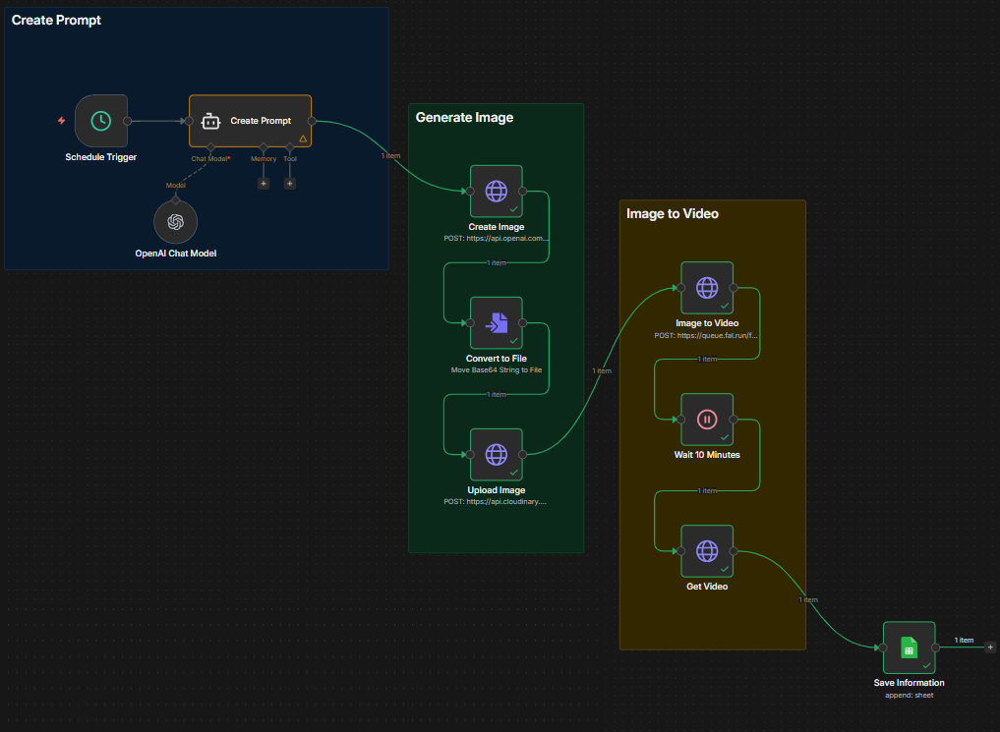

# W6-n8n-Use-Case-03 - Viral Cat YouTube Shorts

## Overview

This n8n workflow automates the creation of AI-generated short-form video content featuring a tabby cat setting traps for a mouse. On a recurring schedule, the workflow generates a unique image prompt via an LLM, creates a high-quality image from that prompt using OpenAI's image generation API (gpt-image-1), uploads the image to Cloudinary, converts it into a short video using the MiniMax Hailuo video model via fal.ai, and logs all generated assets to a Google Sheet for tracking and publishing.

**Workflow Name:** Viral Cat Youtube Shorts
---

## Business Logic

The workflow follows a single linear pipeline with no branching:

1. A schedule trigger fires at a set interval.
2. An AI agent generates a unique, vivid image prompt describing a tabby cat and mouse scene.
3. The prompt is sent to OpenAI's `gpt-image-1` model to create a 1024×1536 portrait image.
4. The base64 image response is converted to a binary file.
5. The binary file is uploaded to Cloudinary to obtain a public URL.
6. The Cloudinary URL is sent to fal.ai's MiniMax Hailuo video model to generate a 9:16 short-form video.
7. The workflow waits 1 minute for video processing to complete.
8. The video result is polled from fal.ai.
9. The image prompt, image URL, and video URL are logged to a Google Sheet.

---

## Architecture Diagram


---

## Node-by-Node Reference

### 1. Schedule Trigger

| Property       | Value                                      |
|----------------|--------------------------------------------|
| **Type**       | `n8n-nodes-base.scheduleTrigger` (v1.2)    |
| **Interval**   | Default (every hour — no custom interval set) |

Fires the workflow on a recurring schedule. The interval is left at default settings (every hour). Adjust this to control how frequently new videos are generated.

---

### 2. Create Prompt (AI Agent)

| Property       | Value                                              |
|----------------|----------------------------------------------------|
| **Type**       | `@n8n/n8n-nodes-langchain.agent` (v2)               |
| **LLM**        | OpenAI Chat Model (gpt-4.1-mini)                   |
| **User Prompt**| "Create a prompt to use for image generation"       |

Generates a unique, detailed image prompt each time the workflow runs. The system prompt defines a specialized assistant that produces vivid, natural-language image descriptions.

**System Prompt Summary:**
The assistant creates descriptive scenarios featuring a tabby cat setting a clever trap for a mouse with cheese. Each prompt describes a cozy home setting with warm, realistic photographic styling, bright sunlit morning atmosphere, and cinematic composition. The output is a raw descriptive paragraph — no headings, no instructions, just the image prompt itself.

**Key creative constraints:**
- Natural, cozy home settings (kitchens, living rooms)
- Warm, sunlit morning atmosphere
- Photorealistic, cinematic wording
- Props like kitchen tools and household items for realism
- Playful, humorous tone with sensory details (light, textures, mood)

---

### 3. OpenAI Chat Model

| Property       | Value                                    |
|----------------|------------------------------------------|
| **Type**       | `@n8n/n8n-nodes-langchain.lmChatOpenAi` (v1.2) |
| **Model**      | `gpt-4.1-mini`                           |


LLM provider for the Create Prompt agent.

---

### 4. Create Image (OpenAI API — HTTP Request)

| Property       | Value                                              |
|----------------|----------------------------------------------------|
| **Type**       | `n8n-nodes-base.httpRequest` (v4.2)                 |
| **Method**     | POST                                                |
| **URL**        | `https://api.openai.com/v1/images/generations`     |


Sends the AI-generated prompt to OpenAI's image generation endpoint.

**Request Body:**
```json
{
  "model": "gpt-image-1",
  "prompt": "{{ $json.output }}",
  "quality": "high",
  "size": "1024x1536"
}
```

The 1024×1536 size produces a portrait-oriented image ideal for YouTube Shorts / TikTok / Instagram Reels (9:16 aspect ratio). The response contains a base64-encoded image in `data[0].b64_json`.

---

### 5. Convert to File

| Property       | Value                                    |
|----------------|------------------------------------------|
| **Type**       | `n8n-nodes-base.convertToFile` (v1.1)    |
| **Operation**  | To Binary                                |
| **Source**      | `data[0].b64_json`                      |


Converts the base64-encoded image from the OpenAI API response into a binary file that can be uploaded to Cloudinary.

---

### 6. Upload Image (Cloudinary)

| Property       | Value                                    |
|----------------|------------------------------------------|
| **Type**       | `n8n-nodes-base.httpRequest` (v4.2)      |
| **Method**     | POST                                     |
| **URL**        | `https://api.cloudinary.com/v1_1/dakni3baj/image/upload` |

Uploads the generated image to Cloudinary using an unsigned upload preset. Returns a public `url` used by the video generation step.

**Body Parameters:**
- `file` — binary image data (field: `data`)
- `upload_preset` — `n8n_uploads`

---

### 7. Image to Video (fal.ai — MiniMax Hailuo)

| Property       | Value                                              |
|----------------|----------------------------------------------------|
| **Type**       | `n8n-nodes-base.httpRequest` (v4.2)                 |
| **Method**     | POST                                                |
| **URL**        | `https://queue.fal.run/fal-ai/minimax/hailuo-02/standard/image-to-video` |
| **Credential** | Header Auth account                                 |

Submits the Cloudinary image URL to fal.ai's MiniMax Hailuo video generation model. This is an asynchronous queue-based API — it returns a `request_id` immediately, and the video must be polled for later.

**Request Body:**
```json
{
  "image_url": "{{ $json.url }}",
  "aspect_ratio": "9:16",
  "prompt": "[Static Camera]"
}
```

The `[Static Camera]` prompt directive keeps the virtual camera stationary, creating a subtle animation effect on the still image — ideal for short-form video content.

---

### 8. Wait 10 Minutes

| Property       | Value                                    |
|----------------|------------------------------------------|
| **Type**       | `n8n-nodes-base.wait` (v1.1)             |


Pauses the workflow to allow fal.ai time to process the video. Despite the node name ("Wait 10 Minutes"), the actual configured duration is **10 minutes**. This may need to be increased if video generation consistently takes longer.

---

### 9. Get Video (fal.ai — Poll Status)

| Property       | Value                                              |
|----------------|----------------------------------------------------|
| **Type**       | `n8n-nodes-base.httpRequest` (v4.2)                 |
| **Method**     | GET                                                 |
| **URL**        | `https://queue.fal.run/fal-ai/minimax/requests/{{ $json.request_id }}/status` |
| **Credential** | Header Auth account           |

Polls the fal.ai queue for the video generation result using the `request_id` received from the Image to Video step. Returns a `response_url` pointing to the completed video file.

---

### 10. Save Information (Google Sheets)

| Property       | Value                                    |
|----------------|------------------------------------------|
| **Type**       | `n8n-nodes-base.googleSheets` (v4.6)     |
| **Operation**  | Append                                   |
| **Credential** | Google Sheets OAuth2 API                 |

Logs the generated assets to the Google Sheet document "MiniMax Viral Videos."

**Column Mapping:**

| Column       | Value Source                                |
|--------------|---------------------------------------------|
| Image Prompt | `Create Prompt` node → `output`            |
| Image URL    | `Upload Image` node → `url` (Cloudinary)   |
| Video URL    | `Get Video` node → `response_url` (fal.ai) |

---

## Credentials Required

| Credential                   | Service         | Used By                           |
|------------------------------|-----------------|-----------------------------------|
| n8n free OpenAI API credits  | OpenAI          | OpenAI Chat Model (prompt gen)    |
| OpenAI account               | OpenAI          | Create Image (gpt-image-1)        |
| Header Auth account          | fal.ai          | Image to Video, Get Video         |
| Google Sheets OAuth2 API     | Google Sheets   | Save Information                  |
| *(unsigned preset)*          | Cloudinary      | Upload Image (preset: `n8n_uploads`) |

---

## External Dependencies

| Service          | Purpose                                                          |
|------------------|------------------------------------------------------------------|
| **OpenAI API**   | gpt-4.1-mini for prompt generation; gpt-image-1 for image creation |
| **Cloudinary**   | Hosts generated images at public URLs for video conversion        |
| **fal.ai**       | MiniMax Hailuo model converts static images to 9:16 short videos  |
| **Google Sheets** | Logs all generated prompts, image URLs, and video URLs           |

---

## Content Pipeline Summary

```
Schedule fires
    │
    ▼
AI writes a vivid image prompt (gpt-4.1-mini)
    │
    ▼
Image generated from prompt (gpt-image-1, 1024×1536, portrait)
    │
    ▼
Base64 → Binary file conversion
    │
    ▼
Image uploaded to Cloudinary (public URL)
    │
    ▼
Image submitted to fal.ai for video generation (MiniMax Hailuo, 9:16, static camera)
    │
    ▼
Wait 1 minute for processing
    │
    ▼
Poll fal.ai for completed video URL
    │
    ▼
Log prompt + image URL + video URL to Google Sheets
```

---

## Setup & Activation Checklist

1. **Import** the workflow JSON into your n8n instance.
2. **Configure OpenAI credentials** — two separate credentials are needed: one for the Chat Model (prompt generation) and one for the Image API (gpt-image-1 requires a paid key with image generation access).
3. **Set up fal.ai** — create an account, generate an API key, and configure the Header Auth credential. The header should be `Authorization: Key YOUR_FAL_API_KEY`.
4. **Set up Cloudinary** — ensure the cloud name (`dakni3baj`) and unsigned upload preset (`n8n_uploads`) exist, or update with your own account details.
5. **Configure Google Sheets OAuth2** and ensure the target spreadsheet ("MiniMax Viral Videos") exists with columns: Image Prompt, Image URL, Video URL.
6. **Adjust the schedule interval** — the default is every hour, which may generate more content (and API costs) than desired.
7. **Adjust the wait duration** — the current 1-minute wait may not be enough for video generation. Test and increase if the Get Video step returns an incomplete status.
8. **Activate** the workflow.

---


