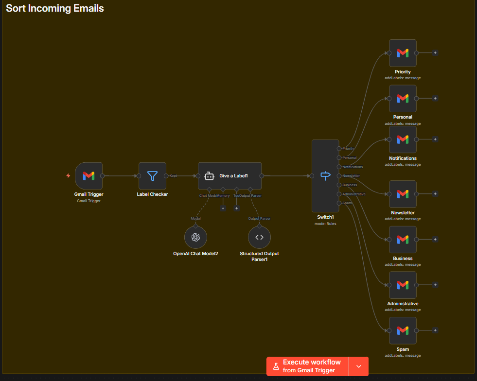
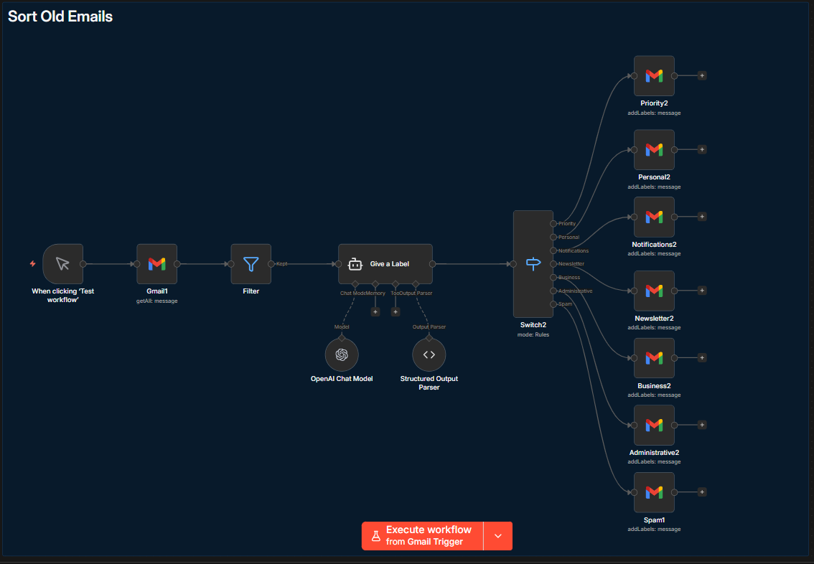

# W6-n8n-Use-Case-03 - Inbox Manager 

## Overview

This n8n workflow automates Gmail inbox organization using AI-powered email classification. It analyzes each email's subject, body, and sender, assigns it to one of seven categories, and applies the corresponding Gmail label — effectively turning a cluttered inbox into an auto-sorted, label-based system. The workflow contains two parallel sub-workflows within a single canvas: one for **incoming emails** (real-time, trigger-based) and one for **old/existing emails** (manual, batch-based).

**Workflow Name:** Inbox Manager
---

## Business Logic

Both sub-workflows follow the same core pipeline:

1. An email is received (or fetched in batch).
2. A filter checks whether the email already has a label — if it does, it's skipped.
3. The email's subject, body text, and sender are passed to an AI agent.
4. The agent classifies the email into one of seven categories and returns a structured JSON response.
5. A switch node routes the email to the correct Gmail label node based on the classification.
6. The Gmail label is applied to the message.

**Email Categories:**

| Category         | Description                                                     |
|------------------|-----------------------------------------------------------------|
| **priority**     | Messages requiring immediate attention (supervisors, clients)    |
| **personal**     | Private messages not related to work                             |
| **notifications**| Messages from social media, Substack, Coinbase, YouTube          |
| **newsletters**  | Newsletter issues                                                |
| **business**     | Correspondence related to projects, contracts, meetings          |
| **administrative**| Invoices, contracts, formal documents                           |
| **spam**         | Unwanted messages, suspicious offers                             |

---

## Architecture Diagram

### Sub-Workflow 1: Sort Incoming Emails (Real-time)



### Sub-Workflow 2: Sort Old Emails (Manual batch)


---

## Sub-Workflow 1: Sort Incoming Emails

### 1. Gmail Trigger

| Property       | Value                                    |
|----------------|------------------------------------------|
| **Type**       | `n8n-nodes-base.gmailTrigger` (v1.2)    |
| **Poll**       | Every 15 minutes (`*/15 * * * *`)        |
| **Simple Mode**| Disabled (returns full email data)        |

Polls the Gmail inbox every 15 minutes for new messages. Returns full email objects including `labelIds`, `subject`, `text`, `from`, and `id`.

---

### 2. Label Checker (Filter)

| Property       | Value                                    |
|----------------|------------------------------------------|
| **Type**       | `n8n-nodes-base.filter` (v2.2)           |

Filters out emails that have already been labeled. Passes only emails where `labelIds[0]` does **not contain** the string `"Label"`. This prevents re-processing of already-classified emails.

---

### 3. Give a Label1 (AI Agent)

| Property       | Value                                              |
|----------------|----------------------------------------------------|
| **Type**       | `@n8n/n8n-nodes-langchain.agent` (v1.8)             |
| **LLM**        | OpenAI Chat Model2 (gpt-4o-mini)                   |
| **Output Parser** | Structured Output Parser1 (JSON schema)         |

The core classification engine. Receives the email's subject, body text, and sender, then classifies it into one of the seven categories.

**User Prompt:**
```
Topic: {{ $json.subject }}
Description: {{ $json.text }}
Sender: {{ $json.from.text }}
```

**System Prompt Summary:**
The AI acts as an intelligent email assistant that analyzes content, subject, and sender to assign each email to the appropriate category. If unsure, it does not label the message. The response must always be lowercase JSON.

**Output Schema (enforced by Structured Output Parser):**
```json
{
  "email_label": "business"
}
```

---

### 4. OpenAI Chat Model2

| Property       | Value                                    |
|----------------|------------------------------------------|
| **Type**       | `@n8n/n8n-nodes-langchain.lmChatOpenAi` (v1.2) |
| **Model**      | gpt-4o-mini                              |

---

### 5. Structured Output Parser1

| Property       | Value                                    |
|----------------|------------------------------------------|
| **Type**       | `@n8n/n8n-nodes-langchain.outputParserStructured` (v1.2) |
| **Schema**     | `{ "email_label": "business" }`          |

Enforces that the AI agent always returns a valid JSON object with a single `email_label` string field.

---

### 6. Switch1

| Property       | Value                                    |
|----------------|------------------------------------------|
| **Type**       | `n8n-nodes-base.switch` (v3.2)           |

Routes the classified email to the appropriate Gmail label node based on `output.email_label`:

| Output | Match Value      | Target Node     |
|--------|------------------|-----------------|
| 0      | `priority`       | Priority        |
| 1      | `personal`       | Personal        |
| 2      | `notifications`  | Notifications   |
| 3      | `newsletters`    | Newsletter      |
| 4      | `business`       | Business        |
| 5      | `administrative` | Administrative  |
| 6      | `spam`           | Spam            |

All comparisons use strict, case-sensitive string equality.

---

### 7. Gmail Label Nodes (×7)

Each label node applies a specific Gmail label to the email using `addLabels` on the message ID from the Gmail Trigger.

| Node Name      | 
|----------------|
| Priority       |
| Personal       | 
| Notifications  | 
| Newsletter     | 
| Business       |
| Administrative | 
| Spam           | 

**Message ID source:** `{{ $('Gmail Trigger').item.json.id }}`

---

## Sub-Workflow 2: Sort Old Emails

This sub-workflow is a near-identical copy of Sub-Workflow 1, designed to process existing emails in batch rather than new ones in real time.

### 8. When clicking 'Test workflow' (Manual Trigger)

| Property       | Value                                    |
|----------------|------------------------------------------|
| **Type**       | `n8n-nodes-base.manualTrigger` (v1)      |

Starts the batch processing manually when the user clicks "Test workflow" in the n8n editor.

---

### 9. Gmail1 (Fetch Emails)

| Property       | Value                                    |
|----------------|------------------------------------------|
| **Type**       | `n8n-nodes-base.gmail` (v2.1)            |
| **Operation**  | Get All                                  |
| **Limit**      | 15 emails per execution                  |
| **Simple Mode**| Disabled (returns full email data)        |

Fetches the 15 most recent emails from the inbox. Each email is processed individually through the classification pipeline.

---

### 10. Filter

| Property       | Value                                    |
|----------------|------------------------------------------|
| **Type**       | `n8n-nodes-base.filter` (v2.2)           |

Same logic as Label Checker — filters out already-labeled emails by checking if `labelIds[0]` does not contain `"Label"`.

---

### 11. Give a Label (AI Agent)

| Property       | Value                                              |
|----------------|----------------------------------------------------|
| **Type**       | `@n8n/n8n-nodes-langchain.agent` (v1.8)             |
| **LLM**        | OpenAI Chat Model (gpt-4o-mini)                    |
| **Output Parser** | Structured Output Parser (JSON schema)          |

Identical classification logic and system prompt as Give a Label1.

---

### 12. OpenAI Chat Model

| Property       | Value                                    |
|----------------|------------------------------------------|
| **Type**       | `@n8n/n8n-nodes-langchain.lmChatOpenAi` (v1.2) |
| **Model**      | gpt-4o-mini                              |

---

### 13. Structured Output Parser

| Property       | Value                                    |
|----------------|------------------------------------------|
| **Type**       | `@n8n/n8n-nodes-langchain.outputParserStructured` (v1.2) |
| **Schema**     | `{ "email_label": "business" }`          |

---

### 14. Switch2

Same routing logic as Switch1. Routes based on `output.email_label` to seven output branches.

---

### 15. Gmail Label Nodes (×7, batch variant)

Identical label IDs as the incoming workflow, but the message ID is sourced from the batch fetch node:

---

## AI Classification Prompt (Shared by Both Sub-Workflows)

**System Prompt:**

The AI agent is instructed to act as an intelligent email assistant that sorts incoming messages by analyzing their content, subject, and sender. The classification rules are:

| Category         | Sorting Criteria                                                  |
|------------------|-------------------------------------------------------------------|
| priority         | Requires immediate attention — from supervisors or clients        |
| business         | Related to current projects, contracts, meetings                  |
| newsletters      | Newsletter issues and subscriptions                               |
| administrative   | Invoices, contracts, formal documents                             |
| personal         | Private messages not related to work                              |
| notifications    | Messages from social media, Substack, Coinbase, YouTube           |
| spam             | Unwanted messages, suspicious offers                              |

If the AI is unsure about the classification, it does not label the message. All responses must be lowercase.

---

## Gmail Label ID Reference

These custom labels must exist in the Gmail account before the workflow can apply them. They are referenced by internal Gmail label IDs.

| Label Name      | 
|-----------------|
| Priority        |
| Personal        |
| Notifications   |
| Newsletter      |
| Business        |
| Administrative  |
| Spam            |

> **Important:** These label IDs are account-specific. If you import this workflow into a different Gmail account, you must create the labels manually in Gmail and update all label nodes with the new IDs.

---

## Setup & Activation Checklist

1. **Import** the workflow JSON into your n8n instance.
2. **Configure the Gmail OAuth2 credential** with appropriate scopes (read, modify, labels).
3. **Create Gmail labels** manually in your Gmail account: Priority, Personal, Notifications, Newsletter, Business, Administrative. (Spam uses the built-in Gmail label.)
4. **Update all 14 Gmail label nodes** with the correct label IDs from your account. You can find label IDs via the Gmail API or by inspecting the n8n Gmail node's label dropdown.
5. **Configure the OpenAI credential** for gpt-4o-mini access.
6. **Activate** the workflow to start processing incoming emails every 15 minutes.
7. **Run the "Sort Old Emails" sub-workflow manually** by clicking "Test workflow" to classify existing emails in batches of 15. Repeat as needed until all old emails are labeled.

---
