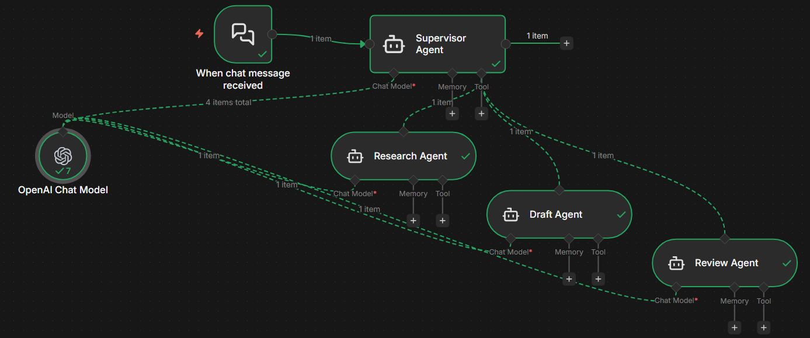

# W6-n8n-Use-Case-03 - Multi-Agent Workflow
---

## Table of Contents

1. [What is Multi-Agent Architecture?](#1-what-is-multi-agent-architecture)
2. [Benefits of Multi-Agent Architecture](#2-benefits-of-multi-agent-architecture)
3. [Workflow Overview](#3-workflow-overview)
4. [Node-by-Node Breakdown](#4-node-by-node-breakdown)
5. [Data Flow Diagram](#5-data-flow-diagram)
6. [Connection & Dependency Map](#6-connection--dependency-map)
7. [System Prompts & Agent Roles](#7-system-prompts--agent-roles)
8. [Configuration Details](#8-configuration-details)
9. [Guardrails & Enforcement Rules](#9-guardrails--enforcement-rules)
10. [How to Use This Workflow](#10-how-to-use-this-workflow)
11. [Extension Ideas](#11-extension-ideas)

---

## 1. What is Multi-Agent Architecture?

Multi-Agent Architecture (MAA) is a design pattern where a **complex task is broken down and delegated across multiple specialized AI agents**, each responsible for a distinct subtask. Rather than relying on a single LLM call to handle everything end-to-end, MAA pipelines the task through a series of focused agents — each operating independently but coordinated by a central **Supervisor**.

### Core Concepts

| Concept | Description |
|---|---|
| **Supervisor Agent** | The orchestrator. Delegates tasks, enforces sequence, and assembles the final output. |
| **Sub-Agents (Tools)** | Specialized workers. Each has a narrow, well-defined role — Research, Draft, or Review. |
| **Sequential Chaining** | Output of one agent becomes the input for the next, creating a pipeline. |
| **Tool-Based Delegation** | Sub-agents are registered as **tools** on the Supervisor, enabling structured, controllable invocation. |
| **Single LLM, Multiple Roles** | One model (GPT-4.1-mini) powers all agents — but each receives a different system prompt, shaping distinct behaviour. |

### The Mental Model

Think of it like a **publishing house**:

```
User Request
     │
     ▼
┌─────────────────┐
│ Editor-in-Chief │  ← Supervisor Agent (orchestrates)
└─────────────────┘
     │ assigns to
     ▼
┌─────────────┐    ┌──────────────┐    ┌───────────────┐
│  Researcher │ →  │  Copy Writer │ →  │  Copy Editor  │
│  (research) │    │   (drafting) │    │   (reviewing) │
└─────────────┘    └──────────────┘    └───────────────┘
                                              │
                                              ▼
                                       Final Output → User
```

---

## 2. Benefits of Multi-Agent Architecture

### 2.1 Separation of Concerns
Each agent is laser-focused on one task. The Research Agent doesn't worry about writing style; the Review Agent doesn't worry about gathering facts. This **reduces cognitive load** on each individual agent call, improving output quality.

### 2.2 Higher Output Quality
By chaining Research → Draft → Review, each stage catches and enriches what the previous stage produced. The final answer is significantly more polished than a single-prompt approach.

### 2.3 Modular & Maintainable
Individual agents can be swapped, upgraded, or reconfigured independently. Want a more aggressive reviewer? Change only the Review Agent's system prompt — the rest of the pipeline is untouched.

### 2.4 Enforced Workflow Integrity
The Supervisor enforces strict sequencing rules (e.g., Draft Agent cannot run until Research Agent output exists). This prevents **shortcutting** and ensures data dependencies are always respected.

### 2.5 Scalability
New agents (e.g., a Fact-Checker Agent or an SEO Agent) can be added as additional tools on the Supervisor without redesigning the whole pipeline.

### 2.6 Auditability
Since each agent produces intermediate outputs, the pipeline is **transparent and debuggable**. You can inspect what the Research Agent returned before the Draft Agent consumed it.

### 2.7 Cost Efficiency
By using a smaller, efficient model (GPT-4.1-mini) rather than a heavy model for every step, and by limiting each call to a narrow scope, the workflow is more **token-efficient** than one massive, complex prompt.

---

## 3. Workflow Overview

### High-Level Flow



The workflow is triggered by a **chat message**, passes through a **Supervisor** that sequentially invokes three sub-agents (Research → Draft → Review), and returns only the polished final answer to the user.

---

## 4. Node-by-Node Breakdown

### Node 1: When Chat Message Received

**Purpose:** This is the trigger node. When a user sends a message via the n8n Chat interface or an integrated chat UI, this node fires and routes the message to the Supervisor Agent. No transformation is applied at this stage — the raw user input is forwarded as-is.

---

### Node 2: Supervisor Agent
| **Role** | Orchestrator — delegates tasks and assembles final output. |

**Purpose:** The brain of the workflow. The Supervisor receives the user's request and, following a strict system prompt, invokes the three sub-agents in sequence. It is explicitly instructed:
- Never return research output directly to the user.
- Always call all three tools in order.
- Return ONLY the `"final"` field from the Review Agent.

**Connected To:** Receives input from the Chat Trigger; invokes Research Agent, Draft Agent, and Review Agent as tools; powered by the OpenAI Chat Model.

---

### Node 3: OpenAI Chat Model

**Purpose:** The shared language model that powers **all four agents** (Supervisor, Research, Draft, and Review). Each agent receives the same model but with a different system prompt, making each one behave differently despite sharing the underlying LLM.

---

### Node 4: Research Agent
| **Role** | Step 1 — Information extraction and analysis. |

**Purpose:** Receives the raw user request and extracts key facts, assumptions, constraints, and points needed to answer the task well. Returns **concise bullet-point notes only** — not a user-facing answer. This output serves as the knowledge base for the Draft Agent.

**Tool Description (what the Supervisor sees):**
> "Analyzes the user request and produces concise research notes, key points, and constraints needed to answer the task. Returns structured internal notes only, not a final user-facing response."

---

### Node 5: Draft Agent
| **Role** | Step 2 — First draft generation. |

**Purpose:** Consumes the research notes from the Research Agent along with the original user request and produces a **clear first draft**. The focus is completeness and correctness — not final polish. This gives the Review Agent solid raw material to refine.

**Tool Description (what the Supervisor sees):**
> "Generates a clear first draft using the user request and the research notes. Focuses on completeness and correctness, not final polish."

---

### Node 6: Review Agent
| **Role** | Step 3 — Final review, editing, and polish. |

**Purpose:** Takes the draft from the Draft Agent and refines it for clarity, correctness, tone, and conciseness. Removes fluff, fixes structure, and ensures the response fully answers the original request. Returns the **final user-facing answer only**.

**Tool Description (what the Supervisor sees):**
> "Reviews and improves the draft for clarity, tone, accuracy, and conciseness. Returns the final user-facing output after refinement."

---

## 5. Data Flow Diagram

```
User sends chat message
         │
         ▼
┌──────────────────────────┐
│   Chat Trigger Node      │
│   (entry point)          │
└──────────────┬───────────┘
               │  raw user message
               ▼
┌──────────────────────────┐
│   Supervisor Agent       │◄──── OpenAI GPT-4.1-mini
│   (orchestrator)         │      (shared model)
└──────────────┬───────────┘
               │
               │  STEP 1: Invokes Research Agent tool
               ▼
┌──────────────────────────┐
│   Research Agent         │◄──── OpenAI GPT-4.1-mini
│   Input:  user request   │
│   Output: bullet notes   │
└──────────────┬───────────┘
               │  research notes
               │  STEP 2: Invokes Draft Agent tool
               ▼
┌──────────────────────────┐
│   Draft Agent            │◄──── OpenAI GPT-4.1-mini
│   Input:  research notes │
│   Output: first draft    │
└──────────────┬───────────┘
               │  first draft
               │  STEP 3: Invokes Review Agent tool
               ▼
┌──────────────────────────┐
│   Review Agent           │◄──── OpenAI GPT-4.1-mini
│   Input:  first draft    │
│   Output: final answer   │
└──────────────┬───────────┘
               │  final polished answer
               ▼
         Supervisor returns
         ONLY the final answer
               │
               ▼
           User receives
         polished response
```

---

## 6. Connection & Dependency Map

> **Note:** The sub-agents (Research, Draft, Review) are registered as **tools on the Supervisor**. This means the Supervisor agent decides when and how to invoke them — they do not run automatically or independently.

---

## 7. System Prompts & Agent Roles

### Supervisor Agent System Prompt

```
You are a Supervisor Agent.

You have 3 tools:
1) research_agent
2) draft_agent
3) review_agent

Rules:
- Never return research output directly to the user.
- Never stop after calling a single tool.
- Always call all three tools in order.

Sequence:
1) Call research_agent with the user request.
2) Call draft_agent using the research_agent output.
3) Call review_agent using the draft_agent output.

Return ONLY the "final" field from review_agent.
You are NOT allowed to call draft_agent unless research_agent output exists.
You are NOT allowed to call review_agent unless draft_agent output exists.
```

### Research Agent System Prompt

```
You are a Research Agent.

Extract key points, facts, assumptions, and anything needed to answer well.

Return concise bullet notes only.
```

### Draft Agent System Prompt

```
You are a Drafting Agent.

Write a clear first draft using the user request and the research notes.

Return the draft only.
```

### Review Agent System Prompt

```
You are a Reviewer Agent.

Improve the draft for clarity, correctness, and conciseness.

Remove fluff, fix structure, ensure it fully answers the request.

Return the final answer only.
```

---

## 9. Guardrails & Enforcement Rules

The Supervisor Agent's system prompt contains several hard-coded guardrails that prevent the workflow from taking shortcuts or producing low-quality outputs:

| Rule | Purpose |
|---|---|
| "Never return research output directly to the user." | Prevents raw, unpolished notes from reaching the user. |
| "Never stop after calling a single tool." | Forces all three agents to run every time. |
| "Always call all three tools in order." | Maintains pipeline integrity — no skipping stages. |
| "NOT allowed to call draft_agent unless research_agent output exists." | Ensures Draft Agent always has context to work with. |
| "NOT allowed to call review_agent unless draft_agent output exists." | Ensures Review Agent always has a draft to refine. |
| "Return ONLY the `final` field from review_agent." | Strips intermediate outputs — user sees only the polished answer. |

---

## 10. How to Use This Workflow

### Step 1: Import the Workflow
1. Open your n8n instance.
2. Go to **Workflows → Import from File**.
3. Upload `Multi_Agentic_Workflow.json`.

### Step 2: Configure OpenAI Credentials
1. Click on the **OpenAI Chat Model** node.
2. Under **Credentials**, select or create an OpenAI API key.
3. Confirm the model is set to `gpt-4.1-mini` (or update to your preferred model).

### Step 3: Activate the Workflow
1. Toggle the workflow from **Inactive → Active** in the top right corner.
2. The Chat Trigger will now be live.

### Step 4: Test It
1. Click **Open Chat** (bottom right in the n8n editor) or integrate the webhook into your front-end.
2. Send any message, such as:
   - *"Explain the pros and cons of remote work for software teams."*
   - *"Write a summary of the latest trends in renewable energy."*
3. The workflow will run Research → Draft → Review and return the final polished answer.

### Step 5: Monitor Execution
1. Go to **Executions** in the sidebar.
2. Inspect each run to see intermediate outputs from each agent.

---

## 11. Extension Ideas

The current workflow is a strong foundation. Here are ways to extend it:

| Extension | How to Add |
|---|---|
| **Web Search Tool** | Attach a web search tool to the Research Agent so it can pull live data. |
| **Fact-Checker Agent** | Add a 4th tool between Draft and Review that validates claims against search results. |
| **Memory / Context** | Connect a memory module to the Supervisor to maintain conversation history across turns. |
| **Output Formatting Agent** | Add a 4th agent to format the final output (Markdown, HTML, JSON, etc.) based on user preference. |
| **Human-in-the-Loop** | Add a wait/approval step after the Draft Agent to allow human review before finalizing. |
| **Multiple LLMs** | Assign a more powerful model (e.g., GPT-4o) only to the Review Agent for higher-quality final output. |
| **Slack / Email Output** | Add a post-processing node to automatically send the final answer to Slack or email. |
| **Logging** | Store each agent's intermediate output in a database (e.g., Supabase, Airtable) for auditing. |

---

